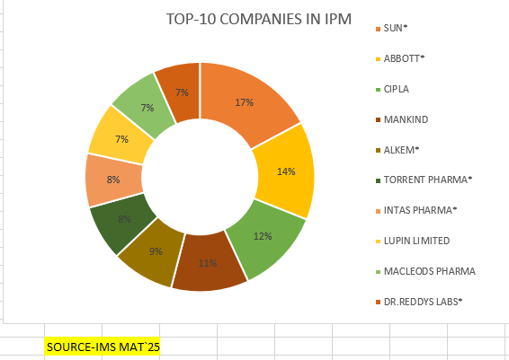
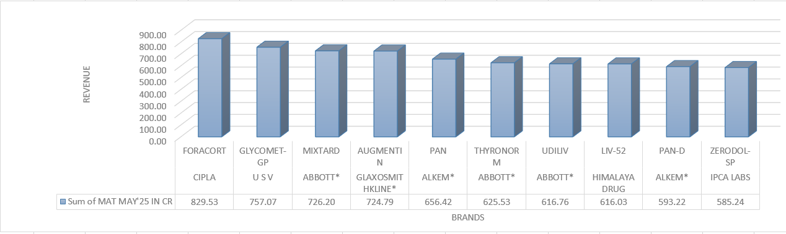
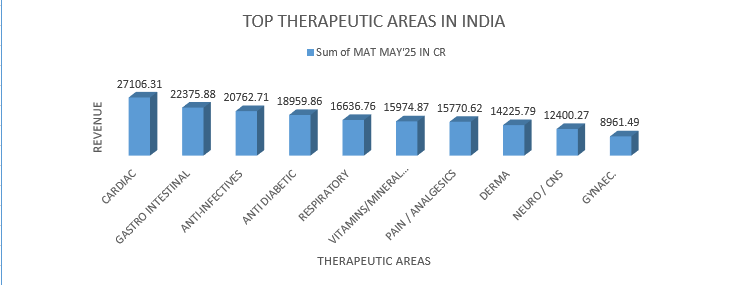

Indian Pharmaceutical Market Analysis (MAT 2025)

Objective  
To analyze the Indian Pharmaceutical Market using MAT 2025 data and identify trends across companies, brands, and therapeutic areas.

Dataset  
- Source: IMS MAT May 2025  
- Data includes: Company, Brand, Revenue, Therapeutic Areas  

Tools Used  
- Microsoft Excel  
- Pivot Tables  
- Data Visualization  

Visual Insights
Company Analysis:- 

Brand Analysis:- 

Therapeutic Area Analysis:- 

Key Insights  
- Sun Pharma leads the market with the highest revenue share  
- Foracort is the top-performing brand in the dataset  
- Cardiac segment contributes the highest overall revenue  
- Market shows strong competition among mid-tier companies  

Business Recommendations  
- Focus on high-growth therapeutic areas like Cardiac and Gastro  
- Strengthen mid-performing brands to gain competitive advantage  
- Invest in chronic therapy segments for long-term growth  

Conclusion  
This project demonstrates how data-driven analysis can help understand market trends and support strategic decision-making in the pharmaceutical industry.
